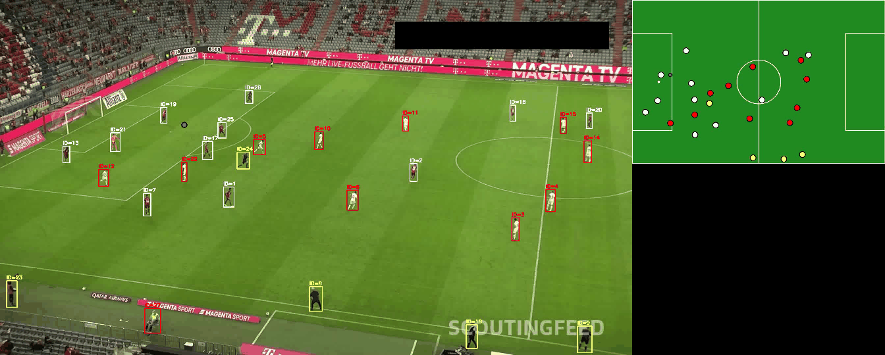
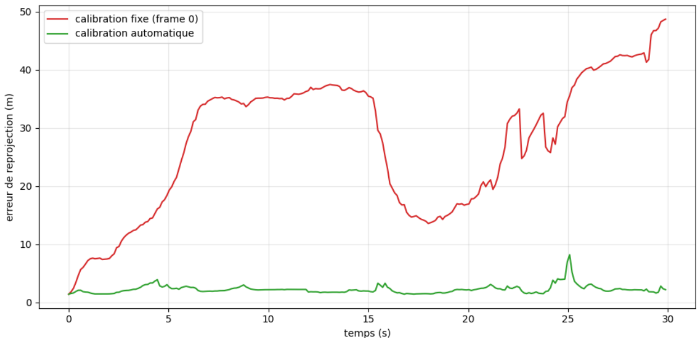
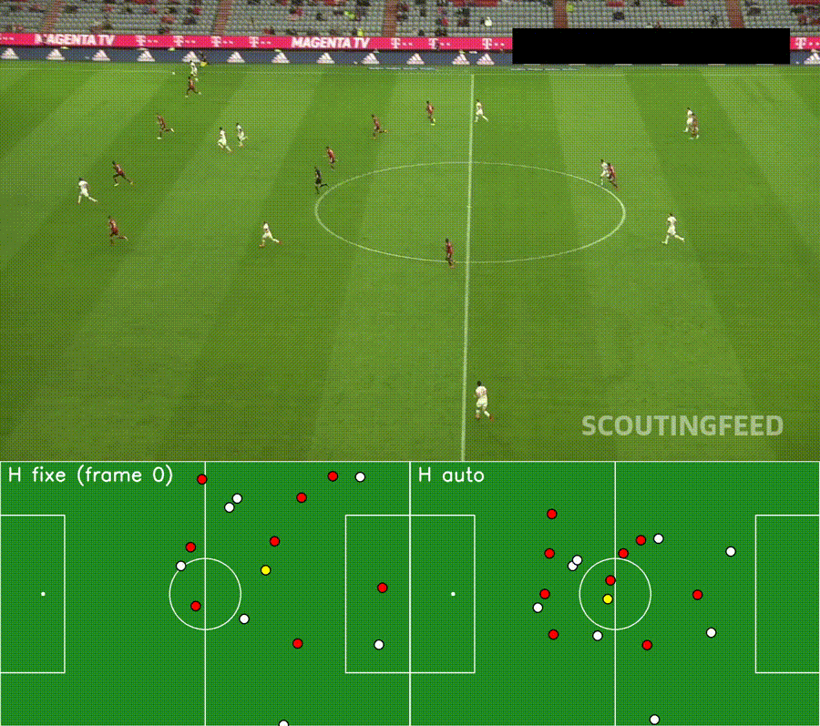
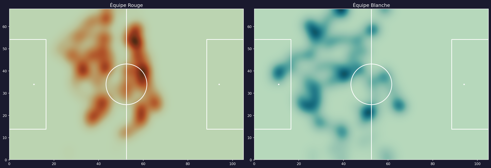
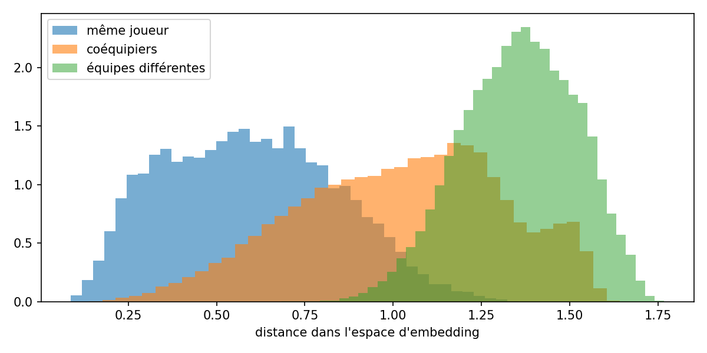

# Football Tracking & Tactical Analysis from Broadcast Video

End-to-end computer vision pipeline that extracts player positions, team assignments and tactical insights from broadcast football footage — the same core problem tracking providers solve in production.



## Overview

Broadcast video is the cheapest and most widely available source of football data, but it comes with no positional metadata. This project reconstructs that data: detecting every player on screen, keeping their identity across frames, mapping pixel coordinates to real pitch coordinates, and producing tactical outputs from it.

| Stage | Method |
|---|---|
| Player detection | YOLOv8x (COCO pre-trained, `conf=0.3`) |
| Multi-object tracking | ByteTrack via `supervision` |
| Pitch calibration | **Automatic per-frame homography** — YOLOv8x-pose fine-tuned on 32 pitch keypoints, RANSAC, temporal smoothing |
| Team assignment | K-Means (k=3) on HSV jersey colours, grass-pixel masking |
| Ball detection | YOLOv8x fine-tuned on a Roboflow football-ball dataset |
| Player re-identification | ResNet18 embedding network, batch-hard triplet loss (custom head and loss, trained on auto-generated labels) |
| Outputs | Composite video (broadcast + 2D minimap), per-team heatmaps |

## Results

### Automatic pitch calibration

Code: [`calibration/pitch_calibration.ipynb`](calibration/pitch_calibration.ipynb)

A YOLOv8x-pose model fine-tuned on 32 pitch landmarks (Roboflow `football-field-detection` dataset, built from DFL footage) detects visible keypoints on every frame. Since the real-world position of each landmark is known from the laws of the game, each frame yields its own image-to-pitch correspondences; the homography is estimated with RANSAC, validated by a reprojection-error check (candidates above 2 m mean error are rejected), and smoothed exponentially over time.

| Metric | Value |
|---|---|
| Keypoint mAP@50 | 0.995 |
| Keypoint mAP@50-95 | 0.731 |
| Clips calibrated with zero manual input | **361 / 460 (78%)** of the dataset |

**Fixed vs automatic calibration on a panning clip** (reprojection error of detected landmarks, in metres):



| | Fixed H (first calibrated frame) | Automatic H |
|---|---|---|
| Mean error | 22.2 m | 1.3 m |
| Max error | 41.9 m | 2.9 m |



At the start of the clip both methods agree; as soon as the camera pans, the fixed homography drifts by tens of metres while the automatic one stays valid. On a static camera segment, a carefully calibrated fixed homography is marginally *more* precise — automatic calibration pays a constant few-metre noise cost for detection error. The trade-off only makes sense at scale: nobody clicks reference points on thousands of matches.

A methodological note: reprojection error measures how consistent each homography is with the known pitch landmarks. It lower-bounds the error on player positions; validating absolute player accuracy would require external ground-truth tracking data.

Per-team occupancy heatmaps over the first seconds of a clip, built from the tactical projection:



### Player re-identification

ByteTrack loses a player's identity whenever they leave the frame or get occluded — the returning player gets a fresh ID, breaking any per-player statistic. The re-id module learns a visual embedding so that a "new" player can be matched against recently lost tracks.

- **Architecture:** ResNet18 backbone (ImageNet), custom embedding head (512 → 512 → 128, L2-normalised)
- **Loss:** batch-hard triplet loss implemented from scratch (Hermans et al., 2017), margin 0.3 — for each anchor, the hardest positive and hardest negative are mined inside the batch, enabled by a P×K sampler (8 tracks × 4 crops)
- **Labels:** free — two crops from the same ByteTrack ID are a positive pair, crops from different tracks are negatives
- **Evaluation:** on 21 held-out tracks never seen during training (66 tracks used for training, 403 queries), query/gallery split in time within each track. Tracks are ByteTrack identities, not verified players, so one player can be split across several tracks.

| Metric | Value |
|---|---|
| Rank-1 | 0.72 |
| Rank-5 | 0.97 |



The distance histogram shows same-player pairs concentrated at small distances, with an overlap against different-player pairs where retrieval errors occur. Errors concentrate on visually similar tracks (same kit, similar pose), some of which may belong to the same player split across IDs; when a jersey number is legible, the model exploits it — intra-team re-identification is the hard problem, exactly as in production systems.

An earlier run with doubled crop resolution (128×64 → 256×128) produced no measurable gain at this data volume (rank-1 0.70 vs 0.73, within run-to-run variance). More training identities is the likely lever.

### Ball detector (fine-tuned, 989 train / 90 val images, 50 epochs)

| Metric | Value |
|---|---|
| mAP@50 | 0.610 |
| mAP@50-95 | 0.256 |
| Precision | 0.831 |
| Recall | 0.546 |

High precision, moderate recall — the detector rarely produces false positives but still misses the ball when it occupies only a few pixels in wide broadcast shots.

**Team separation:** the referee cluster is identified automatically as the darkest of the three K-Means centres (lowest V channel), and the two remaining clusters are the teams. This keeps the pipeline free of manual colour choices on a given clip.

## Pipeline

```
Broadcast frame
├─ YOLOv8x ──────────► player boxes
│                          │
│                     ByteTrack ──► persistent IDs ──► re-id embeddings
│                          │                           (evaluated offline)
│                   HSV K-Means ──► team labels
│
├─ Fine-tuned YOLO ──► ball box (filtered by projected pitch bounds)
│
└─ Pitch keypoint model ──► per-frame homography H (RANSAC + smoothing)
                               │
                               ├─► animated 2D minimap
                               └─► occupancy heatmaps
```

## Design decisions

**Foot point over box centre.** Players are projected using the bottom-centre of their bounding box — the point where they contact the ground — rather than the centroid, which sits at torso height and introduces systematic error under perspective.

**Grass masking before colour clustering.** Naive K-Means on raw jersey crops clusters the pitch, not the kits: players are small in wide shots so background dominates the crop. Masking green-hue pixels in HSV before averaging fixes this.

**Ball filtering by projected position.** The fine-tuned detector picks up balls held by ball boys on the touchline. Rather than filter by image coordinates, candidate detections are projected through `H` and rejected if they fall outside pitch bounds — a filter that stays valid as the camera moves.

**Homography quality gate.** Midfield views are geometrically ill-conditioned: visible keypoints (centre line + circle) are near-collinear, so small detection errors produce large sliding errors along the pitch. Each candidate homography is therefore validated by reprojecting its own source keypoints; candidates above 2 m mean error are rejected and the previous valid H is kept.

**Batch-hard mining over pre-built triplets.** Instead of fixing triplets in advance, each batch contains P identities × K crops and the loss mines the hardest positive/negative per anchor from the full pairwise distance matrix — the standard and far more sample-efficient formulation.

**Track-level evaluation split.** Re-id is evaluated on tracks entirely held out from training, not on held-out crops of tracks seen during training — the embedding must generalise to unseen identities, which is the actual use case.

## Known limitations

- **Stadium domain gap.** The pitch keypoint model was trained on ~300 images and fails on visually atypical stadiums (e.g. the Olympiastadion Berlin with its athletics track — box confidence collapses and detected keypoints are unusable). This accounts for most of the 22% of clips that cannot be auto-calibrated, and is the same generalisation problem commercial systems face at scale.
- **Recalibration jumps.** As the camera moves, the set of visible keypoints changes; each new constellation yields a slightly different H, producing occasional small position jumps on the minimap (visible as brief spikes in the error curve). Frame-to-frame camera motion tracking (optical flow) would smooth this.
- **Track-ID labels.** Re-id labels come from ByteTrack identities, which fragment when a player leaves the frame or is occluded (87 tracks in 20 seconds, more than the 22 players on the pitch). The same player can end up under several IDs, including across the training and test splits, so the scores are an approximation and some counted errors may in fact be correct matches.
- **Intra-team re-id.** Distinguishing teammates from low-resolution back-view crops without visible numbers remains hard; more training identities from additional matches is the highest-impact lever.
- **ID switches.** ByteTrack matches on IoU and motion prediction alone. When two players cross paths, identities can swap. The re-id module targets the leave-and-return case; crossing-path swaps would need appearance-aware tracking.
- **Ball recall in wide shots.** At broadcast resolution the ball is a handful of pixels when play is far from camera. Fine-tuning improved this substantially over the COCO `sports ball` class, but recall remains around 0.55.
- **Team assignment edge cases.** Goalkeepers and dark-kitted players are occasionally assigned to the referee cluster.

## Setup

Runs on Kaggle with GPU enabled (T4 ×2 or P100).

```bash
pip install ultralytics supervision
pip install git+https://github.com/roboflow/sports.git
```

Dataset: [DFL Bundesliga 460 MP4 Videos](https://www.kaggle.com/datasets/saberghaderi/-dfl-bundesliga-460-mp4-videos-in-30sec-csv)

Fine-tuned weights are attached to the Release v1.0 — neither training run needs to be repeated:
- `ball_detector_best.pt` (~1 h on T4)
- `pitch_keypoints_best.pt` (~2-3 h on T4, 100 epochs, `mosaic=0.0`)
- `reid_resnet18.pt`

The pitch keypoint training cell is included in the calibration notebook (`RETRAIN = False` by default). Retraining does not reproduce the published score exactly: a rerun gave 0.62 mAP@50-95 on the 34-image validation split, which has no fixed seed. All results in this repository use the published weights.

## Repository

```
bundesliga_vision.ipynb        full pipeline: tracking, tactical view, ball, re-identification
calibration/
  pitch_calibration.ipynb      automatic calibration, coverage, reprojection error
assets/
  demo.gif
  compare_avant_apres.gif
  erreur_homographie.png
  reid_distances.png
  heatmaps.png
```

Model weights are attached to the Release v1.0.

## Next steps

- Wire the re-id module into the tracking loop (match new IDs against recently lost tracks below an embedding-distance threshold)
- Frame-to-frame camera motion estimation to smooth recalibration jumps
- Event detection (passes, shots) from ball trajectory and possession changes
- Distance covered and speed profiles per player ID
